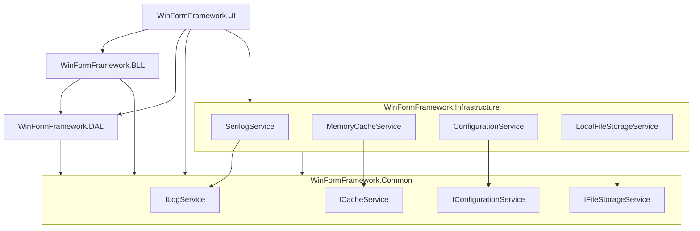

# WinForm框架示例

这是一个基于WinForm的企业级应用程序框架示例，提供了完整的用户权限管理、系统设置、日志记录等基础功能。

## 功能特性

### 1. 用户管理
- 用户的增删改查
- 用户启用/禁用
- 基本信息管理（用户名、真实姓名、邮箱、电话等）
- 用户-角色分配

### 2. 角色管理
- 角色的增删改查
- 系统角色标记
- 角色-权限分配

### 3. 权限管理
- 基于树形结构的权限配置
- 细粒度的功能权限控制
- 权限验证机制

### 4. 系统设置
- 多页签式配置界面
- 系统参数配置
- 配置项分类管理

### 5. 日志管理
- 操作日志记录
- 日志查看器
- 支持按日期、级别筛选
- 日志导出功能

## 技术架构

### 1. 分层架构



项目采用分层架构设计，各层职责如下：

- **UI层** (WinFormFramework.UI)
  - 窗体设计和用户界面交互
  - 权限验证和用户操作控制
  - 依赖注入配置和程序启动
  
- **业务逻辑层** (WinFormFramework.BLL)
  - 业务规则实现和处理
  - 数据验证和业务校验
  - DTO对象转换和数据封装
  
- **数据访问层** (WinFormFramework.DAL)
  - 数据库操作和持久化
  - 数据模型定义
  - 仓储模式实现
  
- **基础设施层** (WinFormFramework.Infrastructure)
  - 日志服务实现
  - 缓存服务实现
  - 配置服务实现
  - 文件存储服务实现
  
- **公共层** (WinFormFramework.Common)
  - 接口定义和抽象
  - 通用工具类
  - 扩展方法
  - 常量定义

依赖关系特点：
- 遵循依赖倒置原则，通过接口实现解耦
- 避免循环依赖，保持清晰的依赖方向
- 高内聚低耦合，便于维护和扩展

### 2. 设计模式
- 依赖注入（DI）
- 仓储模式（Repository）
- 单例模式
- 工厂模式

### 3. 关键技术
- .NET Framework
- WinForms
- Entity Framework
- Microsoft.Extensions.DependencyInjection
- NLog日志框架

## 项目结构

```
BaseSolution/
├── src/
│   ├── WinFormFramework.UI/
│   │   ├── Forms/
│   │   │   ├── MainForm.cs          # 主窗体
│   │   │   ├── LoginForm.cs         # 登录窗体
│   │   │   ├── UserManageForm.cs    # 用户管理
│   │   │   ├── RoleManageForm.cs    # 角色管理
│   │   │   ├── UserRoleForm.cs      # 用户角色分配
│   │   │   ├── PermissionManageForm.cs  # 权限管理
│   │   │   ├── SystemSettingForm.cs # 系统设置
│   │   │   └── LogViewerForm.cs     # 日志查看
│   │   └── Program.cs               # 程序入口
│   ├── WinFormFramework.BLL/        # 业务逻辑层
│   ├── WinFormFramework.DAL/        # 数据访问层
│   └── WinFormFramework.Common/     # 公共类库
└── tests/                           # 单元测试项目
```

## 开发环境要求

- Visual Studio 2019或更高版本
- .NET Framework 4.8
- SQL Server 2012或更高版本

## 快速开始

1. 克隆仓库
```bash
git clone https://github.com/yourusername/BaseSolution.git
```

2. 打开解决方案
```
BaseSolution.sln
```

3. 还原NuGet包
```bash
nuget restore
```

4. 编译运行
- 设置WinFormFramework.UI为启动项目
- 按F5运行项目

## 贡献指南

1. Fork 项目
2. 创建特性分支 (`git checkout -b feature/AmazingFeature`)
3. 提交更改 (`git commit -m 'Add some AmazingFeature'`)
4. 推送到分支 (`git push origin feature/AmazingFeature`)
5. 创建Pull Request

## 许可证

本项目采用 MIT 许可证 - 详见 [LICENSE](LICENSE) 文件

## 联系方式

- 项目维护者：[Your Name]
- 邮箱：[your.email@example.com]

## 致谢

感谢所有为这个项目做出贡献的开发者！
